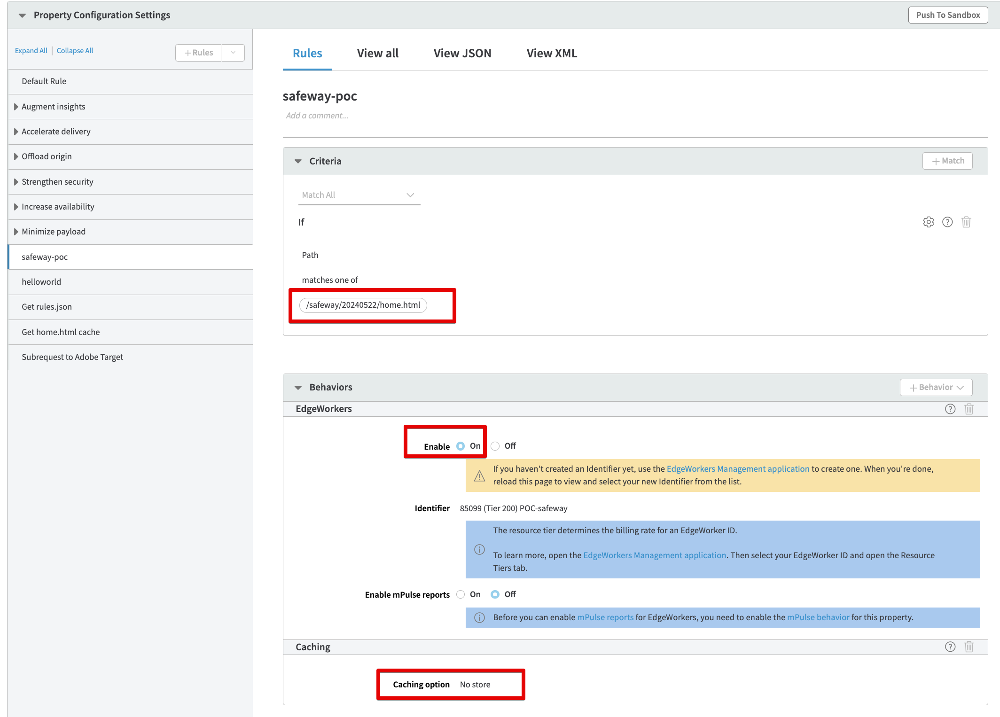

# Akamai Properties Configurations

## Home Page Caching Rules

This rule is a common caching rule for any HTML page. Because we use only one page in this POC, we match it to home.html, but in real world scenario it would be any static page that we want to cache on CDN.

Note, the rule also sets the header `X-Subrequest-Home` to differentiate that this is a subrequest that needs to be cached versus EdgeWorker's non-caching rule explained below.

## Home Page Non-Caching Rules

This rule is similar to above that it runs on same page(s) but is driven by EdgeWorkers and therefore does not cache anything to ensure it runs on every hit.

## Artifacts Caching Rules

Artifacts file is cached in this rule. As a workaround for Akamai restrictions, we have minimized original Artifacts file (https://assets.adobetarget.com/safewayinc/production/v1/rules.json) with a shorter version (https://cimage.adobe.com/safeway/20240522/rules.json), which does not include any unnecessary data. It is set to be cached for 5 minutes to get the latest updates from the origin. 

## Adobe Target Delivery API Non-Caching Rules

This rule ensures that Adobe Node SDK Notification calls firing from the EdgeWorkers script would not be cached. The rule specified domain and path to Adobe Delivery API.

